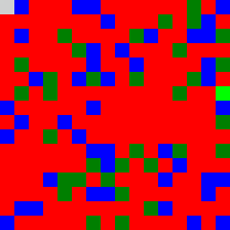

## About me

Hi and welcome to my website!

My name is Alex, and I am a Research Associate at Huawei 2012 Laboratories in London, focussing on Bayesian model-based RL, active inference, and computational neuroscience.

I hold a Master's degree in Artificial Intelligence from Imperial College London, where I was supervised by [Dr. Zafeirios Fountas](http://www.zfountas.com) and [Dr. Matthew Crosby](http://mdcrosby.com/). Prior to Imperial College, I completed a Bachelor's degree at University College London, where I was supervised by [Prof. Mark Miodownik](http://www.markmiodownik.net/).

Here, I post information about my research, ~~thoughts, and opinions~~ (not quite there yet).

## Research

    

    

      <a href="https://vpr-model.github.io/"><b>Variational Predictive Routing with Nested Subjective Timescales</b></a> 
      <a href="{{site.url}}">Alex Zakharov*</a>, <a href="{{site.url}}">Qinghai Guo</a>, <a href="http://www.zfountas.com">Zafeirios Fountas*</a> 
      *Equal contribution 
      <i>Pre-print</i>
    

 

    

    

      <a href="https://ucbtns.github.io/explore/index.html"><b>Exploration and preference satisfaction trade-off in reward-free learning</b></a> 
      <a href="https://ucbtns.github.io/">Noor Sajid</a>, <a href="https://ptigas.com/">Panagiotis Tigas</a>, <a href="{{site.url}}">Alexey Zakharov</a>, <a href="http://www.zfountas.com">Zafeirios Fountas</a>, <a href="https://scholar.google.com/citations?user=q_4u0aoAAAAJ&hl=en">Karl Friston</a> 
      <i>Pre-print</i>
    

 

    

    

      <a href="https://openreview.net/pdf?id=30lZDhrjonR"><b>Episodic Memory for Subjective-Timescale Models</b></a> 
      <a href="{{site.url}}">Alex Zakharov</a>, <a href="http://mdcrosby.com/">Matthew Crosby</a>, <a href="http://www.zfountas.com">Zafeirios Fountas</a> 
      <i>ICML 2021 Workshop on Unsupervised Reinforcement Learning</i>
    

