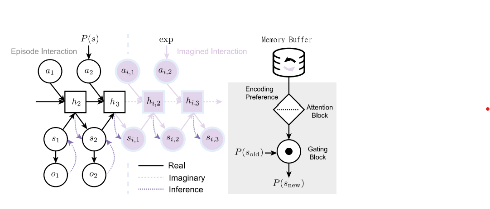
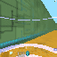

## About me

Hi and welcome to my website!

My name is Alex, and I am a Research Associate at Huawei 2012 Laboratories in London, focussing on Bayesian model-based RL, representation learning, and generative modelling.

I hold a Master's degree in Artificial Intelligence from Imperial College London, where I was supervised by [Dr. Zafeirios Fountas](http://www.zfountas.com) and [Dr. Matthew Crosby](http://mdcrosby.com/). Prior to Imperial College, I completed a Bachelor's degree at University College London, where I was supervised by [Prof. Mark Miodownik](http://www.markmiodownik.net/).

Here, I post information about my research, ~~thoughts, and opinions~~ (not quite there yet).

If you wish to collaborate or simply contact me, drop me an email at brandelt4(@)gmail(.)com.

 

## Research

    

    

      <a href="https://arxiv.org/abs/2207.13699"><b>Modelling non-reinforced preferences using selective attention</b></a> 
      <a href="https://ucbtns.github.io/">N Sajid</a>, <a href="https://ptigas.com/">P Tigas</a>, <a href="http://www.zfountas.com">Z Fountas</a>, <a href="{{site.url}}">Q Guo</a>, <a href="{{site.url}}" style="colour: black;">A Zakharov</a>, <a href="{{site.url}}"> L Da Costa</a>  
      <i>NeurIPS 2022, WiML</i>
    

    

    

      <a href="https://vpr-model.github.io/"><b>Variational Predictive Routing with Nested Subjective Timescales</b></a> 
      <a href="{{site.url}}" style="colour: black;">A Zakharov</a>, <a href="{{site.url}}">Q Guo</a>, <a href="http://www.zfountas.com">Z Fountas</a> 
      <i>ICLR 2022</i>
    

 

    

    

      <a href="https://arxiv.org/pdf/2201.05464"><b>Bayesian sense of time in biological and artificial brains</b></a> 
      <a href="http://www.zfountas.com">Z Fountas*</a>, <a href="{{site.url}}">A Zakharov*</a>  
      *Equal contribution 
      <i>Time and Science 2022</i>
    

 

    

    

      <a href="https://ucbtns.github.io/explore/index.html"><b>Exploration and preference satisfaction trade-off in reward-free learning</b></a> 
      <a href="https://ucbtns.github.io/">N Sajid</a>, <a href="https://ptigas.com/">P Tigas</a>, <a href="{{site.url}}">A Zakharov</a>, <a href="http://www.zfountas.com">Z Fountas</a>, <a href="https://scholar.google.com/citations?user=q_4u0aoAAAAJ&hl=en">K Friston</a> 
      <i>ICML 2021 Workshop on Unsupervised Reinforcement Learning</i>
    

 

    

    

      <a href="https://openreview.net/pdf?id=30lZDhrjonR"><b>Episodic Memory for Subjective-Timescale Models</b></a> 
      <a href="{{site.url}}">A Zakharov</a>, <a href="http://mdcrosby.com/">M Crosby</a>, <a href="http://www.zfountas.com">Z Fountas</a> 
      <i>ICML 2021 Workshop on Unsupervised Reinforcement Learning</i>
    

 

    

    

      <a href="https://link.springer.com/chapter/10.1007/978-3-030-60365-6_17"><b>Geometric Deep Learning for Post-Menstrual Age Prediction</b></a> 
      <a>V Vosylius</a>, <a>A Wang</a>, <a>C Waters</a>, <a href="{{site.url}}">A Zakharov</a>, <a>F Ward</a>, <a>L Folgoc</a>, <a>J Cupitt</a>, <a>A Makropoulos</a>, <a>A Schuh</a>, <a>D Rueckert</a>, <a>A Alansary</a>  
      <i>International Workshop on Graphs in Biomedical Image Analysis 2020</i>
    

